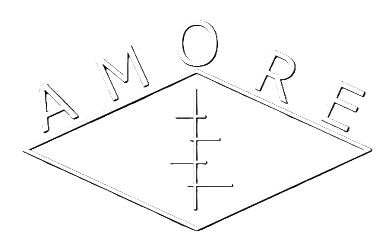

---
format:
  html:
    page-layout: full
---


::: {.content-section}
{.header-logo}

::: {.subtitle-text}
Active Monitoring of Oxytocin Research Evidence
:::

AMORE hosts living meta-analyses for biobehavioral oxytocin research, serving as a centralized platform that aggregates articles and materials on dedicated project pages.

Designed to advance oxytocin biobehavioral research, a standardized framework ensures that all living meta-analyses featured on AMORE maintain timely integration of emerging evidence with rigorous methodology and transparency throughout the research process.


::: {.contact-buttons}
[Publish your Living Meta Analysis](https://nettskjema.no/a/492183){.primary-button target="_blank"}
:::
:::


::: {.initiated-by-section}

::: {.initiated-by-label}
A project by
:::

::: {.initiated-by-content}
[{.bnl-logo}](https://www.sv.uio.no/psi/english/research/groups/bnl/){target="_blank"}
:::

::: {.paper-link}
Read the open access paper describing the development of the platform [here](https://doi.org/10.1016/j.psyneuen.2025.107713){target="_blank"}.
:::

:::


```{=html}
<div class="open-source-section">
  <div class="open-source-inner">
    <div class="open-source-icon">
      <svg xmlns="http://www.w3.org/2000/svg" width="32" height="32" viewBox="0 0 24 24" fill="none" stroke="currentColor" stroke-width="1.5" stroke-linecap="round" stroke-linejoin="round"><path d="M15 22v-4a4.8 4.8 0 0 0-1-3.5c3 0 6-2 6-5.5.08-1.25-.27-2.48-1-3.5.28-1.15.28-2.35 0-3.5 0 0-1 0-3 1.5-2.64-.5-5.36-.5-8 0C6 2 5 2 5 2c-.3 1.15-.3 2.35 0 3.5A5.403 5.403 0 0 0 4 9c0 3.5 3 5.5 6 5.5-.39.49-.68 1.05-.85 1.65-.17.6-.22 1.23-.15 1.85v4"></path><path d="M9 18c-4.51 2-5-2-7-2"></path></svg>
    </div>
    <div class="open-source-text">
      <h3>Open Source</h3>
      <p>AMORE is built with transparency in mind. All code and scripts are publicly available.</p>
      <a href="https://github.com/iaiversen/AMORE-webpage" class="github-link" target="_blank">
        View on GitHub
        <svg xmlns="http://www.w3.org/2000/svg" width="14" height="14" viewBox="0 0 24 24" fill="none" stroke="currentColor" stroke-width="2" stroke-linecap="round" stroke-linejoin="round"><path d="M7 17l9.2-9.2M17 17V7H7"/></svg>
      </a>
    </div>
  </div>
</div>
```
