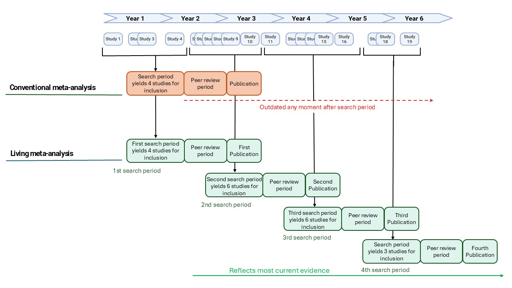

```{=html}
<div class="page-header-bar">
  <h1>Advancing Oxytocin Research Together</h1>
  <p>Building the future of evidence-based research through living meta-analysis and transparent science</p>
</div>
```

::: {.about-tabs-container}
::: {.tab-navigation}
<button class="tab-button active" onclick="showTab('mission')">AMORE Explained</button>
<button class="tab-button" onclick="showTab('living-meta-analyses')">Living Meta Analyses</button>
<button class="tab-button" onclick="showTab('team')">Expert Steering Committee</button>
<button class="tab-button" onclick="showTab('Citation')">How To Cite AMORE</button>
:::

::: {.tab-content}
::: {#mission .tab-pane .active}
## What is AMORE?

AMORE (Active Monitoring of Oxytocin Research Evidence) is a platform that hosts living meta-analyses for oxytocin research investigating biobehavioral outcomes in humans. Each living meta-analysis on AMORE is regularly updated to incorporate new research as it is published, ensuring that the evidence synthesis remains current. All projects on AMORE follow a standardized framework that upholds methodological rigor and transparency.

### Aims of AMORE

```{=html}
<div class="aims-accordion">

  <div class="aims-item">
    <button class="aims-header" onclick="toggleAim(this)">
      <span class="aims-number">1</span>
      <span class="aims-title">Up-to-Date Evidence</span>
      <span class="aims-chevron">&#9660;</span>
    </button>
    <div class="aims-body">
      <p>AMORE provides researchers with access to the most current meta-analytic evidence in oxytocin biobehavioral research. New studies are integrated into the living meta-analyses over time. The update approach is determined by each research team -- some projects update continuously as new studies meeting inclusion criteria are published, others update at set intervals (e.g. every 6, 12, or 24 months), and others update when new evidence is expected to meaningfully change the conclusions. Regardless of the approach, all projects must update within a maximum of 24 months.</p>
    </div>
  </div>

  <div class="aims-item">
    <button class="aims-header" onclick="toggleAim(this)">
      <span class="aims-number">2</span>
      <span class="aims-title">Quality Control</span>
      <span class="aims-chevron">&#9660;</span>
    </button>
    <div class="aims-body">
      <p>The expert steering committee reviews all project proposals to ensure they meet the requirements of the AMORE standardized framework. The committee also monitors ongoing projects to ensure continued adherence to the framework throughout the lifetime of each living meta-analysis.</p>
    </div>
  </div>

  <div class="aims-item">
    <button class="aims-header" onclick="toggleAim(this)">
      <span class="aims-number">3</span>
      <span class="aims-title">Transparent Science</span>
      <span class="aims-chevron">&#9660;</span>
    </button>
    <div class="aims-body">
      <p>The AMORE standardized framework requires open science practices for all projects. This includes pre-registration of protocols, use of free and open-source analysis software, public sharing of datasets and analysis scripts, deviation reports documenting any departures from the registered protocol, and publication of pre-prints. These requirements ensure that every step of the research process is transparent and reproducible.</p>
    </div>
  </div>

</div>

<script>
function toggleAim(btn) {
  var item = btn.parentElement;
  var isOpen = item.classList.contains('open');
  // Close all items
  var items = document.querySelectorAll('.aims-item');
  items.forEach(function(i) { i.classList.remove('open'); });
  // Open clicked item if it was closed
  if (!isOpen) {
    item.classList.add('open');
  }
}
</script>
```

### Who Is AMORE For?

```{=html}
<div class="audience-grid">
  <div class="audience-item">
    <strong>Research Teams</strong>
    Researchers or research teams who want to publish and maintain a living meta-analysis on oxytocin research investigating biobehavioral outcomes in humans.
  </div>
  <div class="audience-item">
    <strong>Anyone Interested in Oxytocin Research</strong>
    Anyone who wants to explore up-to-date meta-analytic evidence on oxytocin and biobehavioral outcomes in humans, whether for academic, educational, or general interest.
  </div>
  <div class="audience-item">
    <strong>Clinicians</strong>
    Clinicians seeking reliable, continuously updated evidence syntheses of human oxytocin research to inform clinical practice and decision-making.
  </div>
</div>
```

:::


::: {#living-meta-analyses .tab-pane}
## What Are Living Meta-Analyses?

A living meta-analysis is a meta-analysis that is updated over time with a clear, pre-defined intention to incorporate new evidence as it becomes available. Unlike a traditional meta-analysis, which represents a snapshot of the evidence at a single point in time and quickly becomes outdated, a living meta-analysis is designed to remain current.

### How Do They Differ from Traditional Meta-Analyses?

A traditional meta-analysis searches the literature up to a fixed date, synthesizes the available evidence, and is published as a final product. As new studies are published after that date, the conclusions may no longer reflect the full body of evidence. A living meta-analysis addresses this by committing to regular updates -- ensuring that the synthesis evolves alongside the growing literature.

It is important to note that "living meta-analysis" does not refer to a specific statistical method or analytical technique. Rather, it describes an approach where any form of meta-analytic methodology can be applied, with the distinguishing feature being the ongoing commitment to updating the analysis over time.

```{=html}
<div style="text-align: center; margin: 2rem 0;">
  
  <p style="font-size: 0.9rem; color: #666; margin-top: 1rem; font-style: italic;">Figure: Traditional vs. Living Meta-Analysis</p>
</div>
```

### Update Strategies

Different living meta-analysis projects may adopt different update strategies depending on the research question and the rate at which new studies are published:

- **Continuous updates**: Some projects update every time a new study meeting the inclusion criteria is published. This approach provides the most current evidence at all times but requires ongoing monitoring of the literature.
- **Threshold-based updates**: Other projects update when new evidence is expected to meaningfully alter the conclusions -- for example, when a sufficiently large or methodologically important study is published.
- **Fixed-interval updates**: Some projects update on a set schedule (e.g. every 6, 12, or 24 months), regardless of how many new studies have appeared. This approach is more predictable and easier to plan around.

On AMORE, all projects must update within a maximum of 24 months. The specific update strategy is determined by the research team and documented in their pre-registered protocol.

### Methodological Considerations

When a living meta-analysis is updated multiple times, the repeated testing of the same hypothesis with accumulating data raises statistical considerations. Corrections for multiple rounds of analysis may be necessary to control the overall error rate. Researchers should pre-specify their approach to handling this in their registered protocol.

### Maintaining Evidence Integrity

A key advantage of the living approach is the ability to respond to changes in the literature. When papers included in the analysis are retracted or corrected, the living meta-analysis can be updated to reflect this -- removing retracted studies and re-running the analysis. This ensures that the evidence synthesis is based only on reliable, non-retracted research.

:::

::: {#team .tab-pane}
## Expert Steering Committee 

The AMORE platform is overseen by a steering committee of experts in the oxytocin research field. The committee:

- Approves project proposals
- Provides methodological guidance
- Ensures computational reproducibility
- Maintains platform standards

### Committee Members {#committee-members}

::: {.committee-grid}

::: {.committee-card}
**Prof. Daniel S. Quintana**
Department of Psychology, University of Oslo, Oslo, Norway  
KG Jebsen Centre for Neurodevelopmental Disorders, University of Oslo, Oslo, Norway  
NevSom, Department of Rare Disorders, Oslo University Hospital, Oslo, Norway
:::

::: {.committee-card}
**Prof. Marian Bakermans-Kranenburg**
William James Center for Research, ISPA – University Institute of Psychological, Social and Life Sciences, Lisbon, Portugal
:::

::: {.committee-card}
**Prof. Jessica J. Connelly**
Department of Psychology, Program in Fundamental Neuroscience, University of Virginia, Charlottesville, USA
:::

::: {.committee-card}
**MPhil Heemin Kang**
Department of Psychology, University of Oslo, Oslo, Norway
:::

::: {.committee-card}
**Prof. Jennifer A. Bartz**
Department of Psychology, McGill University, Montréal, Québec, Canada
:::

::: {.committee-card}
**Prof. Natalie C. Ebner**
Department of Psychology, University of Florida, Gainesville, FL, USA  
Cognitive Aging and Memory Center, McKnight Brain Institute, University of Florida, Gainesville, FL, USA
:::

::: {.committee-card}
**Prof. Dirk Scheele**
Department of Social Neuroscience, Faculty of Medicine, Ruhr University Bochum, Germany  
Research Center One Health Ruhr of the University Alliance Ruhr, Ruhr University Bochum, Germany
:::

::: {.committee-card}
**Prof. Benjamin Becker**
State Key Laboratory of Brain and Cognitive Sciences, The University of Hong Kong, Hong Kong, China  
Department of Psychology, The University of Hong Kong, Hong Kong, China
:::

::: {.committee-card}
**Prof. Kaat Alaerts**
Department of Rehabilitation Sciences, KU Leuven, Neuromotor Rehabilitation Research
:::

::: {.committee-card}
**Dr. Matthijs Moerkerke**
Department of Rehabilitation Sciences and Physiotherapy, Ghent University, Ghent, Belgium
:::

::: {.committee-card}
**Dr. Elizabeth A. Lawson**
Neuroendocrine Unit, Department of Medicine, Massachusetts General Hospital, Massachusetts, USA  
Department of Medicine, Harvard Medical School, Boston, USA
:::

::: {.committee-card}
**Dr. Tanya L. Procyshyn**
Department of Biological Sciences, Simon Fraser University, Burnaby, Canada  
Autism Research Centre, Department of Psychiatry, University of Cambridge, Cambridge, UK
:::

::: {.committee-card}
**Dr. Marilyn Horta**
Department of Health Outcomes and Behavior, Moffitt Cancer Center, Florida, USA
:::

::: {.committee-card}
**Prof. Hidenori Yamasue**
Departments of Psychiatry, Hamamatsu University School of Medicine, Hamamatsu City, Japan
:::

::: {.committee-card}
**Constantina Theofanopoulou**
The Rockefeller University, New York, NY, USA  
New York University, New York, NY, USA  
Emory University, Atlanta, GA, USA
:::

::: {.committee-card}
**Dr. Leehe Peeled Avron**
Department of Psychology, Bar-Ilan University, Ramat-Gan, Israel
:::

::: {.committee-card}
**Senior Scientist Nicole Nadine Løndtfelt**
Center for Social Data Science, Faculty of Social Sciences, University of Copenhagen  
Child and Adolescent Mental Health Center, Copenhagen University Hospital - Mental Health Services CPH, Copenhagen, Denmark
:::

::: {.committee-card}
**Dr. Ekaterina Schneider**
Institute of Medical Psychology, Center for Psychosocial Medicine, Heidelberg University Hospital, Heidelberg, Germany
:::

::: {.committee-card}
**Prof. Beate Ditzen**
Institute of Medical Psychology, Center for Psychosocial Medicine, Heidelberg University Hospital, Heidelberg, Germany
:::

::: {.committee-card}
**Anna-Rosa Cecilie Mora-Jensen**
Child and Adolescent Mental Health Center, Copenhagen University Hospital - Mental Health Services CPH, Copenhagen, Denmark  
Department of Clinical Medicine, Faculty of Health and Medical Sciences, University of Copenhagen
:::

::: {.committee-card}
**Prof. Christian Montag**
Centre for Cognitive and Brain Sciences, Institute of Collaborative Innovation, University of Macau, Macau SAR, China  
Department of Psychology, Faculty of Social Sciences, University of Macau, Macau SAR, China  
Department of Computer and Information Science, Faculty of Science and Technology, University of Macau, Macau SAR, China
:::

::: {.committee-card}
**Prof. Robert James Blair**
Department of Clinical Medicine, Child and Adolescent Psychiatry, University of Copenhagen, Copenhagen, Denmark
:::

::: {.committee-card}
**MSc Alina I. Sartorious**
Department of Psychology, University of Oslo, Oslo, Norway
:::

::: {.committee-card}
**MSc Ingebjørg Anjadatter Iversen**
Department of Psychology, University of Oslo, Oslo, Norway
::: 

:::
:::


::: {#Citation .tab-pane}
## How to Cite AMORE
Please use the following reference to cite AMORE: 

<div style="margin-left: 2rem; text-indent: -2rem; margin-top: 1rem; word-wrap: break-word; overflow-wrap: break-word;">
Iversen, I. A., Alaerts, K., Bakermans-Kranenburg, M., Becker, B., Blair, R. J., Bartz, J. A., Connelly, J. J., Ditzen, B., Ebner, N. C., Kang, H., Lawson, E. A., Lønfeldt, N. N., Moerkerke, M., Montag, C., Mora-Jensen, A.-R. C., Horta, M., Peled-Avron, L., Procyshyn, T. L., Sartorius, A. I., … Quintana, D. S. (2025). The active monitoring of oxytocin research evidence (AMORE) platform. *Psychoneuroendocrinology*, *107713*. https://doi.org/10.1016/j.psyneuen.2025.107713
</div>

:::
:::
:::

<script>
function showTab(tabName) {
  const panes = document.querySelectorAll('.tab-pane');
  panes.forEach(pane => {
    pane.classList.remove('active');
  });
  
  const buttons = document.querySelectorAll('.tab-button');
  buttons.forEach(button => {
    button.classList.remove('active');
  });
  
  document.getElementById(tabName).classList.add('active');
  event.target.classList.add('active');
}
</script>